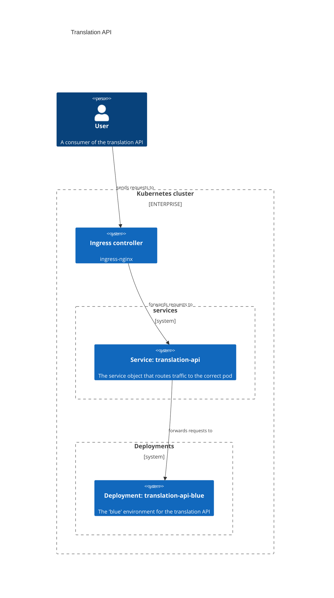
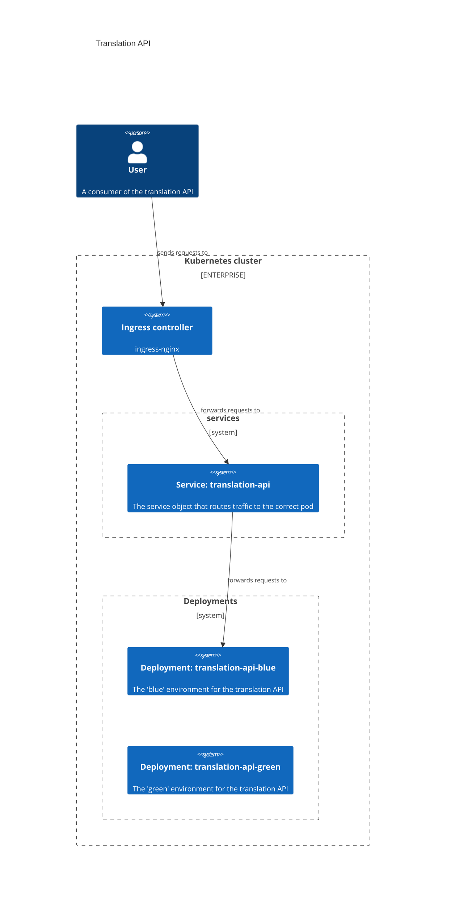
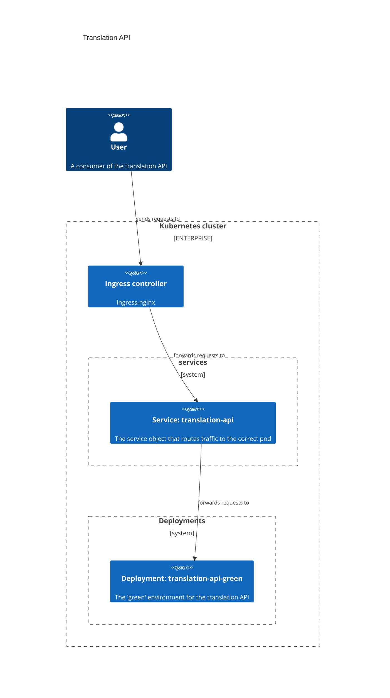

# Dev Lifecycle Challenge

As requested, I have constructed a simple blue/green deployment strategy. On my machine, I was able to sustain approximately 350 req/sec using the test client. While maintaining this level of traffic, cutting over to the `green` environment resulted in _zero_ unsuccessful requests and a _very_ brief (< 0.01 seconds) window of time where the exact version of the API being served flickered between 0.0.1 and 0.0.2.

## Architecture

Below are some details about the environment, why it was built as it was, and some of the details about how the moving parts fit together.

### Application packaging

I built a Dockerfile to bundle up the application and related dependencies. I used a multi-stage build to keep the final container small (I'm not even bundling `pip` in the final build).

I wasn't sure how much I was allowed to change `th3-server.py` for the purposes of this challenge, so I kept the changes to a minimum -- I only changed the version identifier at the top of the file. In a "real" environment, I might want this variable to be set at container build time (perhaps as an env var in the container or maybe some kind of autogenerated `constants.py` that includes a version identifier and is imported into the main server). That way, the entire build process can be automated such that:

* local container builds get tagged with something along the lines of `local-82dbcf64`
* pushes to `develop` result in a container tagged as `dev-2022-11-20`
* pushes to `main` result in a container tagged as `staging-2022-11-20`; and
* git tags result in a container tagged with the tag (`release-v1.2.3`)

To take that a step further, pull requests can have images built and deployed on every push so that it's possible to implement automated preview environment setup/teardown when pull requests are opened/closed.

Regarding dependency management: I'm relatively new to the Python world. I'm aware of other dependency management tools and practices, but I wasn't 100% sure about their applicability to this scenario. I don't think I needed a virtual environment in this case (since the container is the virtual environment in a sense). I wasn't sure if "enterprise" projects still use `requirements.txt` or if people have moved on to `Pipfile`s or `nix` or whatever the tool-du-jour is. As in other places, since I was unsure, I erred toward simplicity.

While the application can connect to Redis, I chose to not include a Redis deployment in this repository. In a production environment, I'd lean toward using an external, managed service like [Amazon MemoryDB for Redis](https://aws.amazon.com/memorydb/) instead of running Redis directly inside the Kubernetes cluster.

### Test client

The test client is about as simple as it gets: it simply sends HTTP requests as quickly as it can for as long as it continues to run. When interrupted by the user, a summary is printed showing the total number of requests sent, the number of failed requests, the amount of time that the client was running, the average number of requests per second, and the most recent version identifier that the client saw in the server response.

A couple of things to note here:

* Every 1000 requests, a line is printed with an intermediate summary of total vs failed requests.
* If a request fails, a message will be shown -- one for each failed request.
* If the version _changes_ from one request to the next, another intermediate summary will be displayed stating that a new version was found.

### Kubernetes deployment

My local environment is a brand-new installation of Docker for Mac with the Kubernetes functionality enabled in the settings. The only customization that was done to this environment was to install [ingress-nginx](https://kubernetes.github.io/ingress-nginx/).

Since I was working in a local environment, there is no separate registry that containers are being pushed to/pulled from: the images are built by the Docker daemon provided by Docker Desktop and are immediately available to the Kubernetes cluster running in that same VM.

Other than that, this setup is relatively straightforward. At the start, the environment is configured like so:

The ingress routes requests (via the service) to the blue environment, which responds to the request.

When it's time to deploy a new version of the application, a new "green" environment is created alongside the blue environment:

When the green environment is up and running and it's time to cut traffic over to the new version, it's a simple update to the translation API service to redirect traffic:

Once the new environment is serving traffic, the old environment can potentially be decommissioned, which brings the process back to the beginning state:

## Testing the deployment process

1. Get Kubernetes up and running and ensure that ingress-nginx is listening on `http://localhost:80`. On Docker for Mac, you shouldn't have to do anything special to make this work.
2. `pushd app && docker build -t translation-api:0.0.1 . && popd`
3. `kubectl apply -f ./manifests/01_app_v1.yaml`
4. Edit `app/th3-server.py` and change `__version__` to `"0.0.2"`
5. `pushd app && docker build -t translation-api:0.0.2 . && popd`
6. `kubectl apply -f ./manifests/02_green_deployment.yaml`
7. (In a separate terminal) `python3 util/testclient.py`
8. `kubectl apply -f ./manifests/03_translation_api_service_switch.yaml`

If you'd prefer not to go through the hassle of setting this stuff up locally, I also recorded a [short video overview](https://youtu.be/UuByuYeLY7k) of the entire process for you.
